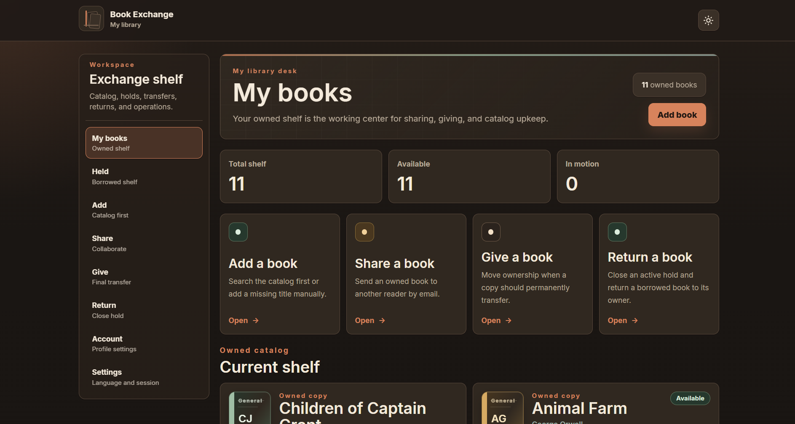
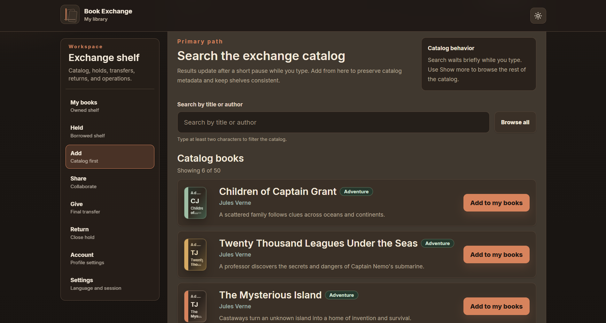
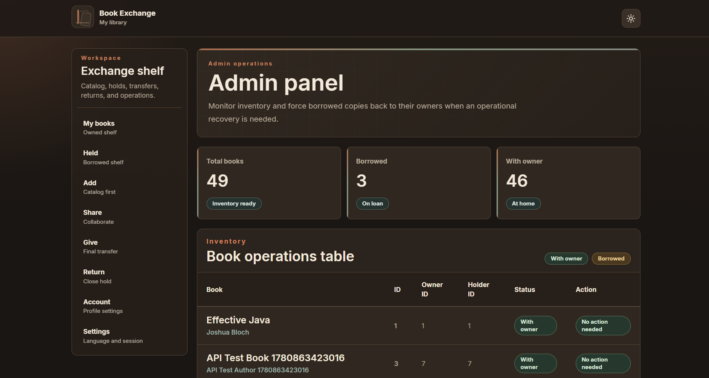

<div align="center">

# 📚 Book Exchange

### A full-stack platform for sharing, gifting and managing physical books

Book Exchange helps users build a personal library, discover books through a shared catalog, temporarily lend copies, permanently transfer ownership and manage every exchange from one workspace.

[](https://github.com/vladwpnz/book-exchange-ui/actions)
[](https://github.com/vladwpnz/book-exchange-api-tests/actions)


</div>

---

## Overview

Book Exchange is a portfolio full-stack application focused on the complete lifecycle of a physical book.

A user can:

* register and sign in;
* maintain a personal book collection;
* search a shared catalog;
* add physical copies to their library;
* lend a book temporarily;
* give a book to another user permanently;
* return a borrowed book;
* track ownership and current possession;
* manage inventory through an administrator panel.

The project consists of three separate repositories:

| Repository                                                                     | Purpose                                     |
| ------------------------------------------------------------------------------ | ------------------------------------------- |
| [book-exchange-ui](https://github.com/vladwpnz/book-exchange-ui)               | React frontend and interactive landing page |
| [book-exchange-api](https://github.com/vladwpnz/book-exchange-api)             | Spring Boot REST API and database layer     |
| [book-exchange-api-tests](https://github.com/vladwpnz/book-exchange-api-tests) | Independent black-box API test suite        |

---

## Application Preview

### Landing page

A responsive product landing page introduces the application and its main workflows.


### Interactive 3D story

The scroll-driven Three.js scene visually explains the book lifecycle through four stages:

1. **Add** — register a physical copy in the library.
2. **Share** — lend it temporarily while keeping ownership.
3. **Give** — permanently transfer ownership.
4. **Return** — return a borrowed copy to its owner.


### Personal library

Users can view owned books, availability, current exchanges and the status of every copy.



### Shared catalog

The catalog supports searching by title or author and adding an existing catalog entry to a personal library.



### Administrator panel

Administrators can inspect the complete inventory, review ownership and holder information, delete books and force the return of borrowed copies.



---

## Core Features

### Authentication and authorization

* User registration
* HTTP Basic authentication
* Protected application routes
* Persistent frontend authentication state
* User and administrator roles
* Role-based access to administration features
* Strict credential validation

### User profiles

* Personal profile page
* Name and email information
* Avatar support
* User statistics
* Owned and held book counters

### Personal library

* View all owned books
* View currently held books
* Track available and borrowed copies
* See the current owner and holder
* Manage books from a responsive dashboard
* Loading, error and empty states

### Book catalog

* Shared catalog containing 50 books
* Search by title or author
* Debounced search requests
* Cover, author, genre and description metadata
* Add books directly from catalog results
* Add a missing title manually
* Duplicate catalog-book protection

### Exchange workflows

#### Share

Temporarily transfer a physical copy to another registered user while preserving the original owner.

#### Give

Permanently transfer ownership and possession to another user.

#### Return

Allow the current holder to return a borrowed copy to its owner.

#### Administration

Allow an administrator to force-return a copy when manual intervention is required.

### Internationalization

The application supports five interface languages:

* English
* Polish
* Ukrainian
* Russian
* Simplified Chinese

Locale resources are loaded separately to reduce the initial application bundle.

### Themes and accessibility

* Dark theme
* Light theme
* Responsive layouts
* Keyboard-accessible controls
* Semantic DOM content
* Reduced-motion support
* WebGL fallback
* Screen-reader-friendly decorative Canvas

---

## Interactive 3D Landing Experience

The landing page includes a custom procedural 3D book scene created without external 3D models.

### Scene details

* Procedural book cover and spine
* Rounded and bevelled geometry
* Layered page block
* Animated page sheets
* Endpapers and gutter details
* Bookmark geometry
* Ownership seals
* Temporary sharing markers
* Transfer paths
* Warm archival materials
* Dynamic lighting and contact shadows
* Dust and memory particles
* Scroll-driven camera movement
* Stage-specific animations

### Performance considerations

* Lazy-loaded 3D scene
* Route-level code splitting
* Separate Three.js chunk
* Adaptive rendering quality
* Adaptive pixel ratio
* Viewport-aware Canvas lifecycle
* Reduced-motion fallback
* WebGL error boundary
* Bundle analysis with Rollup Visualizer

The optimized 3D scene chunk is approximately:

```text
34.63 kB
8.66 kB gzip
```

---

## Technology Stack

### Frontend

| Technology        | Usage                                   |
| ----------------- | --------------------------------------- |
| React 19          | Component-based interface               |
| TypeScript        | Static typing                           |
| Vite              | Development server and production build |
| React Router      | Routing and protected pages             |
| Axios             | REST API requests                       |
| Tailwind CSS      | Utility-based styling                   |
| i18next           | Internationalization                    |
| Three.js          | 3D rendering                            |
| React Three Fiber | React integration for Three.js          |
| Drei              | Three.js utilities                      |
| GSAP              | Scroll-driven animation                 |
| Maath             | Animation and mathematical helpers      |
| ESLint            | Static code analysis                    |
| Rollup Visualizer | Bundle inspection                       |

### Backend

| Technology        | Usage                            |
| ----------------- | -------------------------------- |
| Java 17           | Backend language                 |
| Spring Boot 3     | Application framework            |
| Spring Web        | REST controllers                 |
| Spring Security   | Authentication and authorization |
| Spring Data JPA   | Repository layer                 |
| Hibernate         | Object-relational mapping        |
| MySQL 8.4         | Relational database              |
| Flyway            | Versioned database migrations    |
| Bean Validation   | Request validation               |
| Springdoc OpenAPI | API documentation                |
| Maven             | Build and dependency management  |
| Docker Compose    | Local database environment       |

### Testing

| Technology           | Usage                             |
| -------------------- | --------------------------------- |
| JUnit 5              | Unit and integration tests        |
| Spring Boot Test     | Application context tests         |
| Spring Security Test | Authentication and security tests |
| RestAssured          | Black-box HTTP API testing        |
| AssertJ              | Fluent assertions                 |
| Jackson              | JSON mapping                      |
| Postman              | Manual API testing                |
| GitHub Actions       | Continuous integration            |

---

## Architecture

```text
┌─────────────────────────────────────┐
│        React + TypeScript UI         │
│                                     │
│  Landing • Library • Catalog • Admin│
└─────────────────┬───────────────────┘
                  │
                  │ REST + HTTP Basic Auth
                  ▼
┌─────────────────────────────────────┐
│          Spring Boot API             │
│                                     │
│ Controllers • Services • Security   │
│ Repositories • Validation • OpenAPI │
└─────────────────┬───────────────────┘
                  │
                  │ JPA / Hibernate
                  ▼
┌─────────────────────────────────────┐
│             MySQL 8.4                │
│                                     │
│ Users • Catalog • Copies • Ownership│
└─────────────────────────────────────┘
```

### Repository structure

```text
book-exchange-ui
├── src/api
├── src/auth
├── src/components
├── src/features/landing3d
├── src/i18n
├── src/layout
├── src/pages
├── src/router
└── docs/screenshots

book-exchange-api
├── controllers
├── services
├── repositories
├── entities
├── security
├── validation
├── Flyway migrations
└── backend tests

book-exchange-api-tests
├── authentication tests
├── book tests
├── transfer tests
├── administration tests
├── test helpers
├── response models
├── Postman collection
└── GitHub Actions workflow
```

---

## Main API Workflows

| Area             | Method and endpoint               |
| ---------------- | --------------------------------- |
| Register user    | `POST /register`                  |
| Read profile     | `GET /profile`                    |
| Add book         | `POST /book/add`                  |
| List owned books | `GET /owned`                      |
| List held books  | `GET /held`                       |
| Share book       | `POST /book/share`                |
| Give book        | `POST /book/give`                 |
| Return book      | `POST /book/return`               |
| Admin inventory  | `GET /items`                      |
| Delete book      | `DELETE /book/delete?id={id}`     |
| Force return     | `POST /book/return/force?id={id}` |

The API uses HTTP Basic authentication. There is no separate login endpoint; credentials are verified through protected API requests.

---

## Local Setup

### Requirements

Install:

* Java 17
* Maven
* Node.js
* npm
* Docker Desktop
* Git

---

### 1. Clone the repositories

```bash
git clone https://github.com/vladwpnz/book-exchange-api.git
git clone https://github.com/vladwpnz/book-exchange-ui.git
git clone https://github.com/vladwpnz/book-exchange-api-tests.git
```

---

### 2. Start MySQL

```bash
cd book-exchange-api
docker compose up -d
```

Docker Compose starts:

```text
Container: book-exchange-mysql
Image: mysql:8.4
Port: 3306
Database: friendssharing
```

Check the container:

```bash
docker compose ps
```

---

### 3. Start the backend

```bash
cd book-exchange-api
mvn spring-boot:run
```

The API starts at:

```text
http://localhost:8080
```

Flyway automatically validates and applies database migrations.

OpenAPI documentation is available through the Springdoc Swagger interface while the backend is running.

---

### 4. Configure the frontend

```bash
cd book-exchange-ui
npm install
```

Create a `.env` file:

```env
VITE_API_BASE_URL=http://localhost:8080
```

Start the development server:

```bash
npm run dev
```

---

### 5. Create a production build

```bash
npm run build
```

Preview the production build:

```bash
npm run preview
```

Analyze bundle composition:

```bash
npm run build:analyze
```

---

## Testing and Validation

### Frontend validation

```bash
npm run build
npm run lint
npm run build:analyze
npm audit
```

Latest verified frontend result:

```text
Production build: passed
ESLint: passed
Bundle analysis: passed
npm audit: 0 vulnerabilities
Browser console errors: 0
```

Validated viewport sizes:

* 375px
* 768px
* 1024px
* 1440px

Also verified:

* dark and light themes;
* all supported languages;
* reduced-motion fallback;
* sticky 3D scrolling;
* no horizontal overflow;
* no text and Canvas overlap.

---

### Backend tests

Run from `book-exchange-api`:

```bash
mvn clean verify
```

Latest verified result:

```text
Tests run: 77
Failures: 0
Errors: 0
Skipped: 0

BUILD SUCCESS
```

The backend suite covers:

* controllers;
* services;
* repositories;
* security;
* validation;
* catalog integration;
* duplicate book protection.

---

### Black-box API tests

Start the backend first.

Then open `book-exchange-api-tests`.

#### PowerShell

```powershell
$env:BOOK_EXCHANGE_API_BASE_URL = "http://localhost:8080"
$env:BOOK_EXCHANGE_API_REQUIRE_AVAILABLE = "true"

mvn clean test
```

#### Linux or macOS

```bash
export BOOK_EXCHANGE_API_BASE_URL=http://localhost:8080
export BOOK_EXCHANGE_API_REQUIRE_AVAILABLE=true

mvn clean test
```

Latest verified result:

```text
AdminApiTest: 10 passed
AuthApiTest: 7 passed
BookApiTest: 7 passed
BookTransferApiTest: 6 passed

Tests run: 30
Failures: 0
Errors: 0
Skipped: 0

BUILD SUCCESS
```

The API test suite verifies:

* registration;
* valid and invalid authentication;
* protected endpoints;
* adding books;
* owned and held book lists;
* temporary sharing;
* permanent ownership transfer;
* returning borrowed books;
* invalid transfer scenarios;
* administrator permissions;
* inventory listing;
* book deletion;
* forced returns.

---

## Continuous Integration

### Frontend

GitHub Actions runs the frontend build and lint checks for pull requests and supported branches.

### API tests

The independent API workflow:

1. starts a MySQL service;
2. checks out the real backend repository;
3. starts the Spring Boot application;
4. waits until the API becomes available;
5. runs all RestAssured tests;
6. uploads Maven Surefire reports.

This keeps the test suite independent from the API implementation.

---

## Key Engineering Decisions

### Separate API test repository

Black-box tests are stored separately from the backend to verify the public HTTP contract without relying on internal implementation details.

### HTTP Basic authentication

The project intentionally keeps a simple HTTP Basic authentication flow appropriate for the current application scope.

### Catalog and physical copies

A catalog entry represents general book metadata, while a personal book represents a specific physical copy owned or held by a user.

### Database migrations

Flyway maintains reproducible schema and seed-data changes.

### Procedural 3D scene

The landing animation uses generated Three.js geometry instead of external models, making the experience fully controlled from the codebase.

### Progressive enhancement

The main content remains available when WebGL is unavailable or reduced motion is enabled.

---

## Project Highlights

* Full-stack architecture across three repositories
* Authentication and role-based authorization
* Physical ownership and possession modelling
* Shared book catalog with search
* Complete Share, Give and Return workflows
* Administrative inventory management
* Flyway database migrations
* Dockerized MySQL environment
* 77 passing backend tests
* 30 passing black-box API tests
* GitHub Actions CI
* Five-language interface
* Dark and light themes
* Responsive dashboard
* Interactive procedural 3D landing story
* Route and locale code splitting
* Adaptive rendering and accessibility fallbacks

---

## Author

### Vladyslav Spyrydonov

Junior Software Developer focused on full-stack development, backend APIs, frontend applications and automated testing.

* GitHub: [@vladwpnz](https://github.com/vladwpnz)
